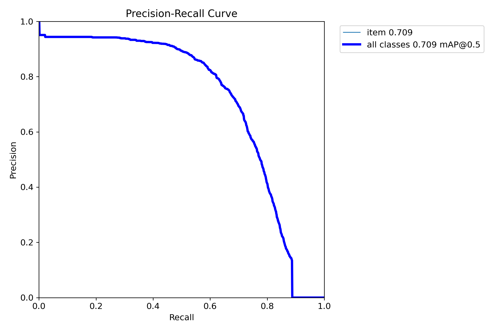
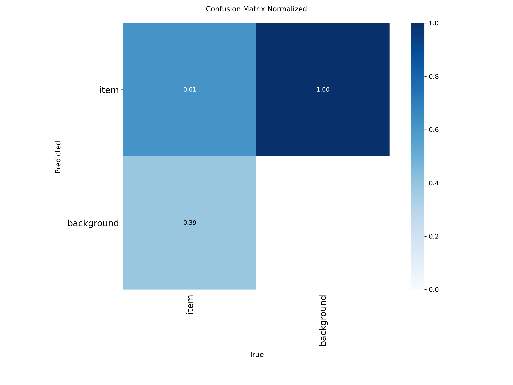
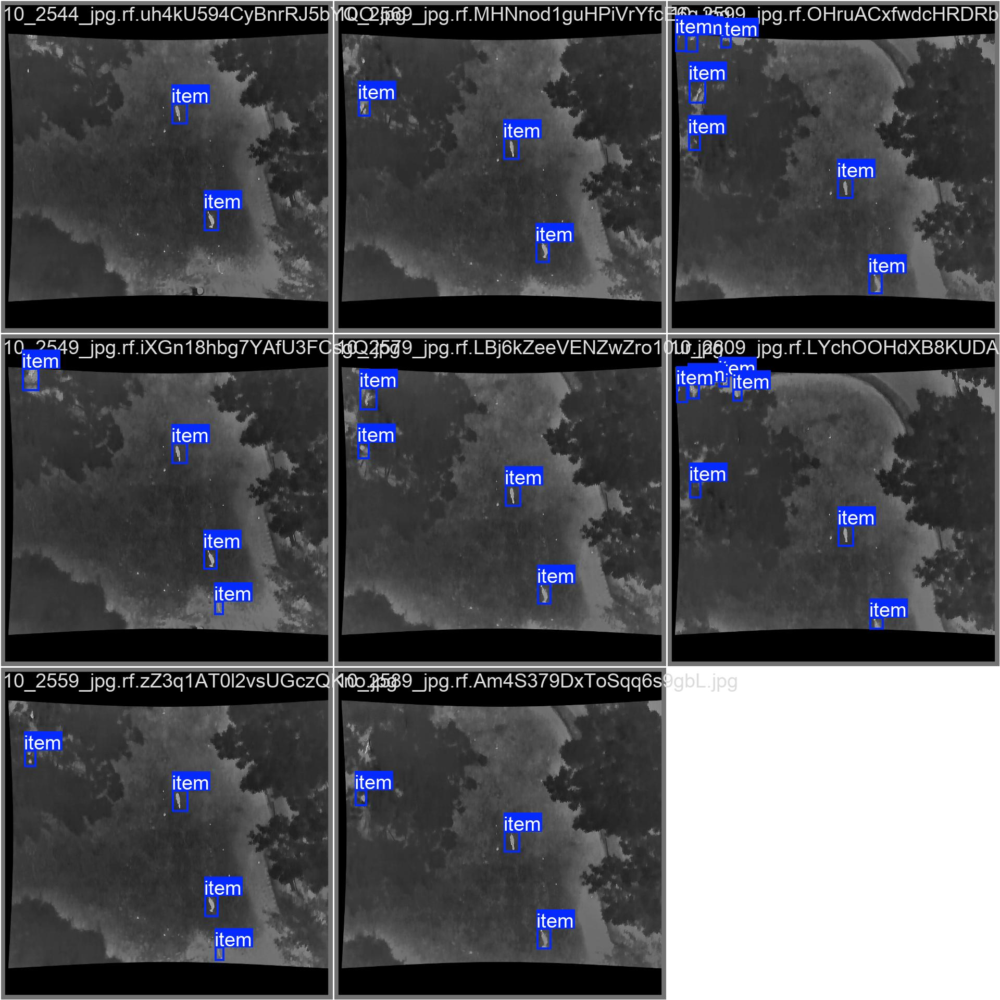
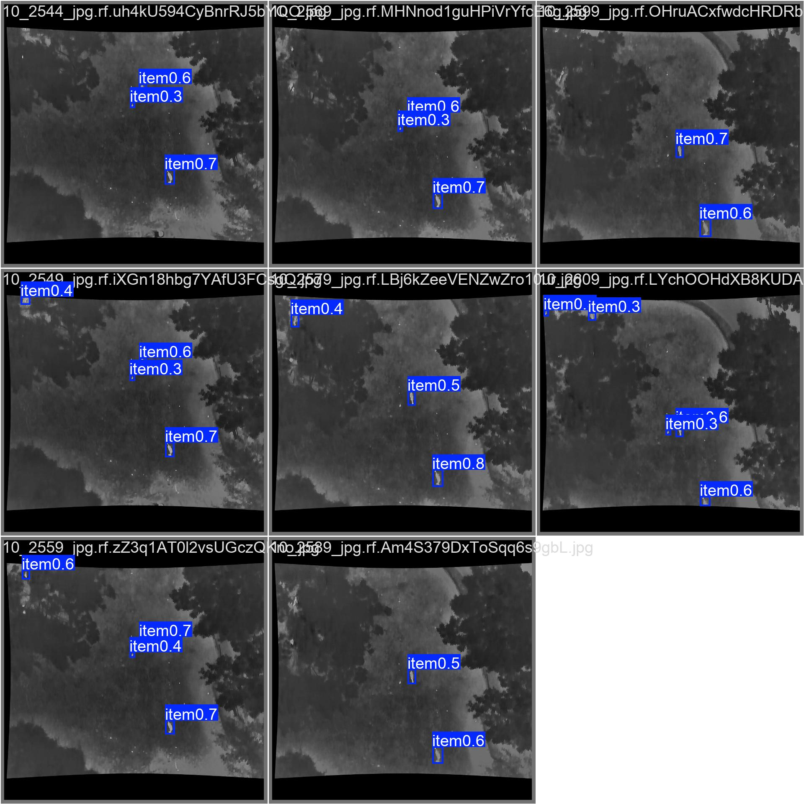
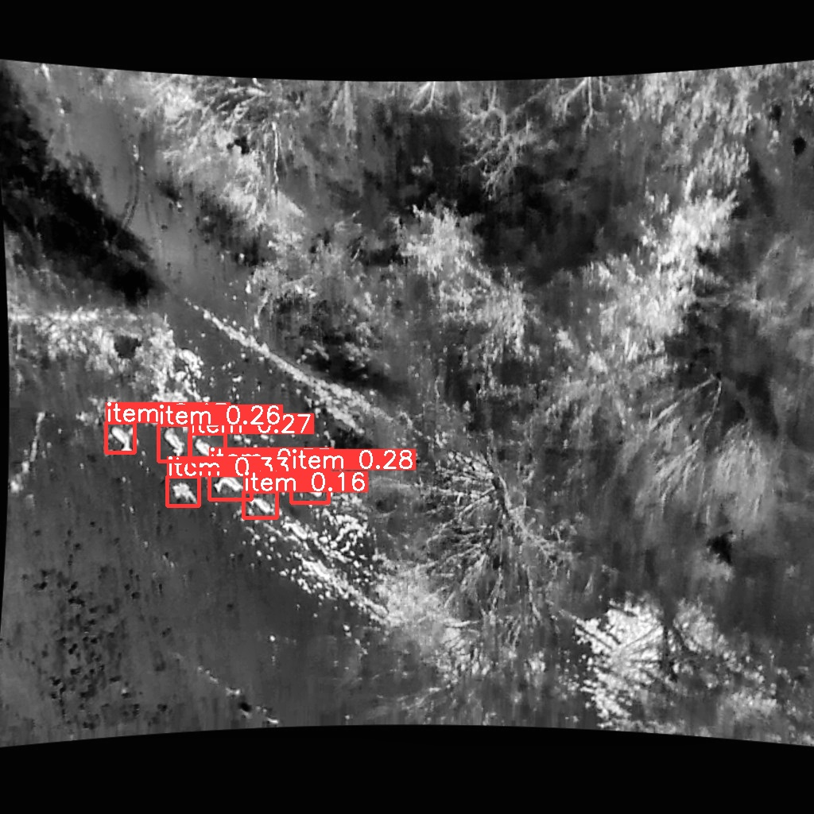
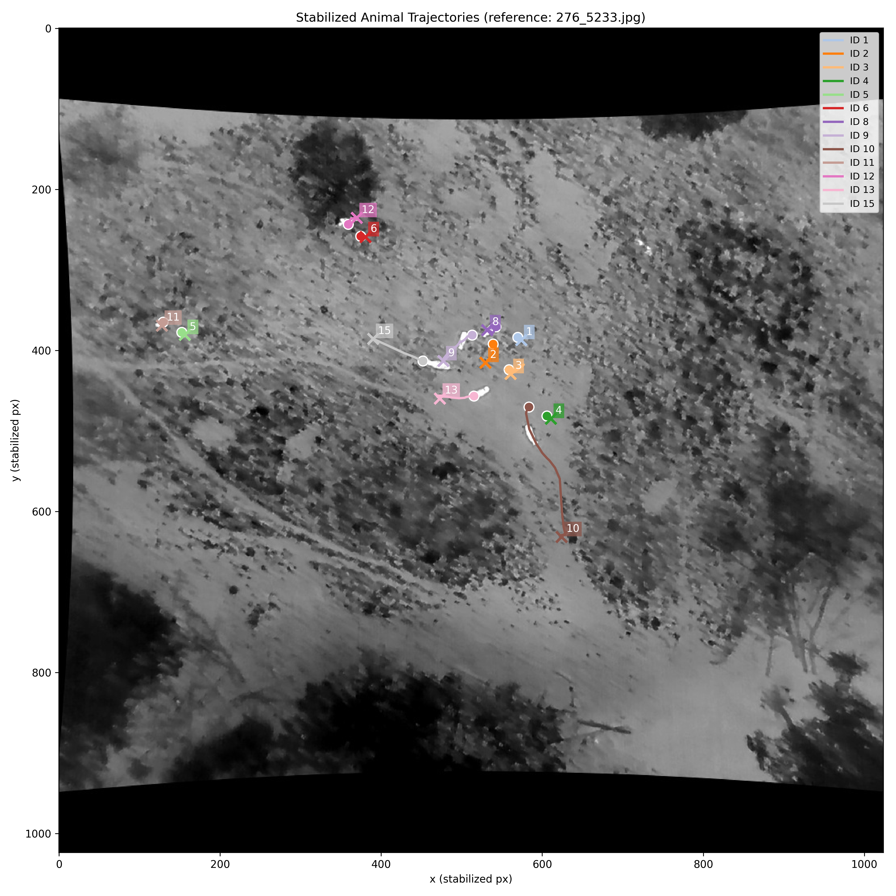
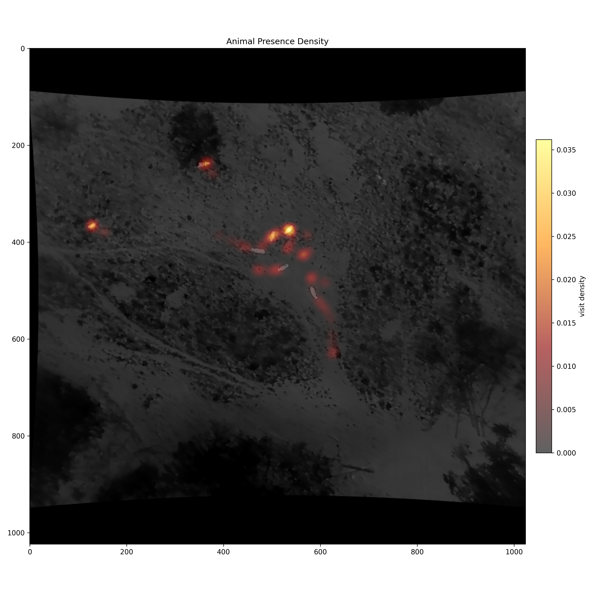
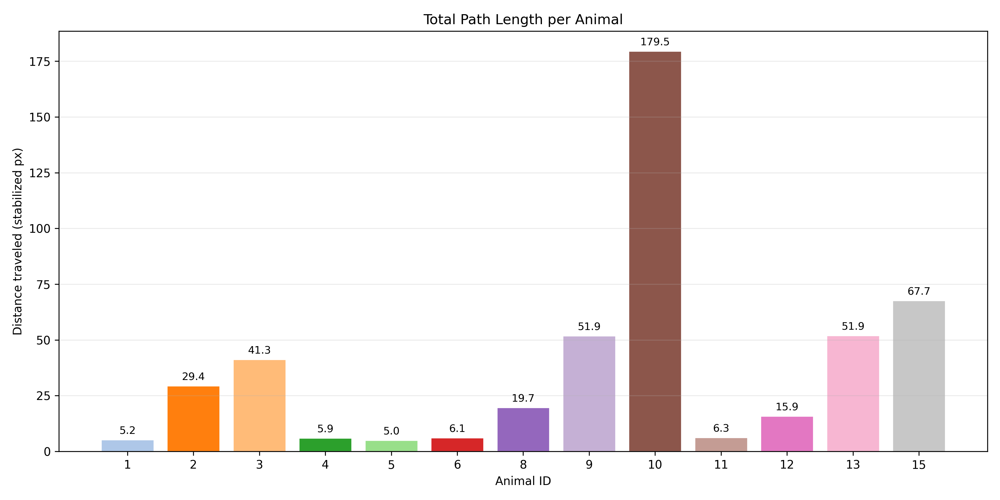

# Flying Hirsch - Drone-based Wildlife Detection & Movement Analysis

## Introduction

Monitoring wild animals from the air is hard: thermal drone footage is low-contrast,
the animals are tiny (often just 20–60 px²), they look like blurry blobs and the
drone itself keeps moving, so the whole scene drifts between frames.

**Flying Hirsch** is a computer-vision pipeline that tackles exactly this problem. It
takes thermal images recorded by a drone and:

1. **Detects** animals and draws a bounding box around each one,
2. **Tracks** every animal across consecutive frames with a stable, unique ID and
3. **Analyses movement** by reconstructing each animal's trajectory and spatial
   distribution over time.

The result is a reusable workflow - from raw dataset to annotated detections, tracked
IDs and trajectory videos - that turns raw thermal flights into usable wildlife
movement data.

### Team
- Karim Ortner
- Lorenz Schlosser
- Jonas Welt

---

## Pipeline Overview

The project is organized as a sequential pipeline. Each stage feeds the next and the
documentation below follows exactly this order:

1. **Choose & Explore Dataset**
2. **Data Preprocessing & Annotation**
3. **Train Object Detection**
4. **Train Object Tracking**
5. **Evaluate Model & Create Statistics**
6. **Visualize Results**

The implementation lives in the `pipeline/` folder. Scripts are numbered to match the
pipeline order (`01_download.py`, `02_check_dataset.py`, `03_convert_labels.py`,
`03b_copy_data_one_class.py`, `04_*exploration`, `05_preprocessing.ipynb`,
`06_exploration_annotated.ipynb`, `07_train_yolo.py`, `08_validate.py`,
`09_predict.py`, `09b_visualize_prediction.ipynb`, `10_tracking.py`, `10b_*visualization`).

---

## Our Approach

### 1. Choose & Explore Dataset

We worked with two thermal wildlife datasets over the course of the project.

**ALFS dataset** (initial) - [zenodo.org/records/18772136](https://zenodo.org/records/18772136)
- **Pro:** animals were annotated *by species*.
- **Con:** very blurry images, weird/inconsistent shapes and a huge class imbalance.

**Matched Frames Subset of the BAMBI UAV Wildlife Dataset** (final) - [zenodo.org/records/19034999](https://zenodo.org/records/19034999)
- **Pro:** much better image quality, matched frames and ready-made train/val/test splits.
- **Con:** fewer labels and **no species information**.

Because the species labels in ALFS were unreliable and heavily imbalanced, we
ultimately collapsed everything into a **single `animal` class**. Also we used the second dataset instead since the images had a much better quality.

**Key dataset facts (BAMBI subset):**

| Property | Value |
| --- | --- |
| Train / Test / Val | ~11,391 / ~1,934 / ~840 images |
| Image size | 1024 × 1024 |
| Min / Avg / Max animal area | 21 px² / 1,922 px² / 61,620 px² |

**Final training dataset** - [zenodo.org/records/20728879](https://zenodo.org/records/20728879)

The Roboflow-annotated thermal dataset used for training is downloaded into
`datasets/processed/annotated_thermal/`.

**Dataset layout** (project root, paths defined in `config.py`):

```
datasets/
├── raw/
│   ├── alfs_data/        # initial ALFS dataset
│   ├── thermal_data/     # BAMBI thermal images + labels
│   └── rgb_data/         # matching RGB images (for annotation)
└── processed/
    └── annotated_thermal/   # final labelled training data (train / val / test)
```

**Scripts used in this stage**
- `01_download.py` - downloads ALFS, BAMBI thermal/RGB and the final labelled dataset from Zenodo into the folder structure above.
- `02_check_dataset.py` - sanity check that every image has a matching label file across ALFS, thermal, RGB and annotated datasets.
- `03_convert_labels.py` - remaps the original 75 fine-grained species IDs down to coarser classes (and finally to a single class), rewriting the YOLO `.txt` labels in place.
- `04_exploration_ALFS.ipynb` / `04_exploration.ipynb` - notebooks that explore label distributions, box sizes and image quality for each dataset.
- `03b_copy_data_one_class.py` - reproduces the *exact same* train/val/test split from the old ALFS dataset on the new BAMBI thermal data, so results stay comparable across dataset switches.

### 2. Data Preprocessing & Annotation

Raw thermal frames are noisy, so we clean and normalize them before training. The
core helpers live in `utils/preprocess_methods.py` and are driven from
`05_preprocessing.ipynb` (with `06_exploration_annotated.ipynb` to inspect the
annotated dataset in `datasets/processed/annotated_thermal/`).

**Cleaning** - frames and labels are dropped when they are not usable:
- **Blurry images** are detected via the variance of the Laplacian (low variance = blurry).
- **Mostly-black images** are removed when over ~93% of pixels are near-zero.
- **Invalid / tiny boxes** (out-of-range coordinates, or boxes smaller than ~1.5% of the image) are filtered out.

**Normalization** - `normalize_thermal()` applies min–max normalization to stretch each
image to the full 0–255 range. This boosts contrast and makes faint animals far more
visible.

**Splitting** - We used `03b_copy_data_one_class.py` to initialize the split by copying the original split, but the original split included too little images in the val set. Therefore we **corrected the split based on flight ID**, so frames from one flight stay together and we don't have any data leakage.

**Re-annotation with Roboflow** - the original labels were not sufficient for a good accuracy of the model, so we manually
re-annotated **~9,338 images** (train + val) in Roboflow: removed wrong boxes,
corrected sizes and added missing animals. We used the matching RGB images during
annotation for better insight into what each thermal blob actually was.

### 3. Train Object Detection 

**Goal:** reliably detect animals in low-contrast thermal drone images.

We use **Ultralytics YOLO** (YOLO26) as the detector. Initially we also tested everything with YOLO11. All shared settings live in
`config.py` and `07_train_yolo.py` runs the actual training.

#### Configuration - `config.py`

`config.py` centralizes everything so the other scripts stay clean. All paths are
built from `Path` objects relative to the project root:

```python
DATA_PATH = PROJECT_ROOT / "datasets"
DATA_PATH_RAW = DATA_PATH / "raw"
DATA_PATH_PROCESSED = DATA_PATH / "processed"

ANNOTATED_DATASET_PATH = DATA_PATH_PROCESSED / "annotated_thermal"
THERMAL_DATASET_PATH = DATA_PATH_PROCESSED / "thermal_data"
THERMAL_IMAGES_PATH = THERMAL_DATASET_PATH / "images"
DATA_YAML = ANNOTATED_DATASET_PATH / "data.yaml"

# Preprocessing
KEEP_BACK_PERCENT = 0.2
BLURRY_THRESHOLD = 0.3

# Validation / SAHI / tracking
VAL_IMGSZ = 1024
SAHI_SLICE_SIZE = 512
SAHI_OVERLAP = 0.25
SAHI_CONF = 0.15
SAHI_USE_CLAHE = True

PREDICT_SOURCE = THERMAL_IMAGES_PATH / "test2"
TRACK_SOURCE = THERMAL_IMAGES_PATH / "test2"
TRACKER_CONFIG = PIPELINE_DIR / "trackers" / "botsort.yaml"

YOLO_EXPERIMENT_NAME = "ir_animal_detection"
BEST_WEIGHTS = PIPELINE_DIR / "best_weights" / "best.pt"
```

#### Training script - `07_train_yolo.py`

`07_train_yolo.py` handles dataset verification, config generation and training in one
script. `create_dataset_config()` checks that train/val images and labels exist, then
writes a `data.yaml` into the annotated dataset folder. `train_yolo_model()` loads
`yolo26s.pt` and trains with our final optimized hyperparameters:

```python
MODEL_SIZE = 'yolo26s.pt'
EPOCHS = 70
BATCH_SIZE = 8
IMG_SIZE = 1024

training_args = {
    'data': config_path,
    'epochs': EPOCHS, 'batch': BATCH_SIZE, 'imgsz': IMG_SIZE,
    'device': "cuda", 'patience': 20, 'workers': 8,
    'project': str(YOLO_RUNS_DIR), 'name': MODEL_NAME,
    'optimizer': 'MuSGD',
    'lr0': 0.00038, 'lrf': 0.882, 'momentum': 0.948,
    'mosaic': 0.992, 'mixup': 0.05, 'copy_paste': 0.404,
    'scale': 0.9, 'fliplr': 0.304, 'translate': 0.275,
    'hsv_h': 0.0, 'hsv_s': 0.0, 'hsv_v': 0.2,   # thermal: no hue/sat jitter
    'single_cls': True,
}
```

**Why these settings?**
- **`hsv_h=0`, `hsv_s=0`** - thermal images carry no meaningful color, so hue/saturation augmentation would only add noise. Only brightness (`hsv_v`) is jittered.
- **Mosaic / copy-paste / scale / translate** - strong geometric augmentation so the model generalizes across different drone heights, angles and positions.
- **`single_cls=True`** - all detections are treated as one `animal` class.
- **`MuSGD` optimizer** - stable convergence on a small-object, low-signal dataset.

After training, the script validates the model and exports it to ONNX. The best
weights are saved to `pipeline/best_weights/best.pt`.

#### Training journey

Reaching a usable model took several iterations. Each change moved the mAP@0.5
forward:

| Stage | Change | mAP@0.5 |
| --- | --- | --- |
| 1 | Raw dataset, no preprocessing, YOLO11 | ~2% |
| 2 | Switched to YOLO26 | ~3.5% |
| 3 | Preprocess + remove blurry images | ~6% |
| 4 | Limit to classes with enough data (12 → 8) | ~8% |
| 5 | New dataset, single class (animal / no animal) | ~35% |
| 6 | Improved annotations for ~9k samples (Roboflow) | ~66% |
| 7 | Fine-tuned YOLO params + image size 1024 | **~72%** |

The two biggest jumps came from (5) simplifying to a single robust class on a cleaner
dataset and (6) fixing the annotations.

### 4. Train Object Tracking

**Goal:** follow each detected animal across a thermal image sequence with a
persistent ID - despite the drone constantly moving. Implemented in `10_tracking.py`.

`10_tracking.py` processes multiple flight sequences in one run. For each flight ID
it loads images from `datasets/processed/thermal_data/images/` (`test2` or `val2`
splits), stabilizes them and tracks animals. Results are saved to
`runs/detect/track/track_ir_animal_detection_{flight}_{split}/`.

Because the camera moves, naive tracking would confuse camera motion with animal
motion. The pipeline solves this in stages:

1. **Stabilize to a reference frame** - one frame is chosen as the reference. Every
   other frame is aligned to it using **ORB features (5000)** + a partial-affine
   transform estimated with RANSAC. This cancels out the drone's movement so the
   background stays still and only the animals move.
2. **Smooth the transforms** - the per-frame transforms are decomposed
   (translation, rotation, scale) and median-smoothed over a small window to remove
   jitter. A neighbor-fallback handles frames where matching fails.
3. **Filter low-quality frames** - blurry or low-contrast frames can be skipped so
   they do not break tracking.
4. **Detect + track** - the trained YOLO detector runs on the stabilized frames and
   **BoT-SORT** assigns persistent IDs across frames.
5. **Post-process tracks** - short tracks are removed and small ID gaps are bridged
   to keep trajectories continuous.
6. **Build trajectories** - each animal's path is reconstructed from its bounding-box
   center points and exported to `trajectories.json` / `trajectories.txt`, alongside
   overlay images and videos.

This stabilize-then-track design means the recorded trajectories reflect *real animal
movement*, not camera drift.

### 5. Evaluate Model & Create Statistics

`08_validate.py` runs YOLO's validation on the held-out split using our best weights
(`best_weights/best.pt`) and writes metrics + plots to `runs/detect/validate/`.
Metrics are also saved to `best_weights/metrics.txt`.

**Best model performance:**

| Metric | Value |
| --- | --- |
| Precision | 0.763 |
| Recall | 0.663 |
| mAP@0.5 | **0.724** |
| mAP@0.5:0.95 | 0.252 |

The **precision–recall curve** confirms strong precision (~0.94) that holds up to
~0.5 recall before falling off - expected behaviour given how small and faint many
animals are:



The **normalized confusion matrix** shows the core trade-off: when the model fires, it
is usually right, but a fraction of real animals are still missed as background - the
hardest part of tiny-thermal-object detection.



### 6. Visualize Results

#### Detection - Ground Truth vs. Prediction

Side-by-side validation batches show the labels (top) against the model's predictions
(bottom). The model finds most animals, with confidences shown per box.

**Ground truth:**



**Prediction:**



`09_predict.py` additionally runs **SAHI sliced inference** with optional CLAHE
contrast boost on the test images from `datasets/processed/thermal_data/images/test2`,
which helps recover very small or faint animals that a single full-frame pass would
miss. A sample subset is saved to `runs/detect/predict/SAMPLESPACE_ir_animal_detection/`:



#### Tracking - IDs & Trajectories

The tracking overlays draw each animal's bounding box, ID and a fading trail of its
recent path on the stabilized frames. Below, flight 276 (`track_ir_animal_detection_276_test2`)
shows stable IDs and clean trajectory trails after stabilization, a heatmap and also
the total distance traveled per ID.







Full results - including the stabilized frames, overlay videos
(`tracking_overlay_video.mp4`), trajectory videos and the `trajectories.json` /
`trajectories.txt` exports - are saved per sequence under
`runs/detect/track/`. The notebooks `10b_10_visualize_tracking.ipynb` and
`10b_276_visualize_tracking.ipynb` render these trajectories per flight. Prediction
samples can be explored with `09b_visualize_prediction.ipynb`.

---

## Summary

Flying Hirsch is an end-to-end thermal wildlife pipeline that goes from raw drone
footage to tracked animal trajectories:

- **Data:** moved from the species-labeled but noisy ALFS dataset to the cleaner BAMBI
  subset, then re-annotated ~9k frames and collapsed to a single robust `animal` class.
- **Detection:** a YOLO26 model (`ir_animal_detection`), fine-tuned with thermal-specific augmentation and
  sliced (SAHI) inference, reaches **~0.72 mAP@0.5** - up from ~2% in the first naive
  attempt.
- **Tracking:** frames are stabilized to a reference (ORB + affine), then YOLO +
  BoT-SORT produces persistent IDs and per-animal trajectories that reflect real
  movement rather than camera drift.
- **Output:** annotated detections, ID overlays, trajectory videos and structured
  trajectory data ready for movement and spatial-distribution analysis.

The biggest lessons: **data quality beats model size** (annotation fixes and a single
clean class drove the largest gains) and **stabilization is essential** before any
meaningful movement analysis on drone footage.
